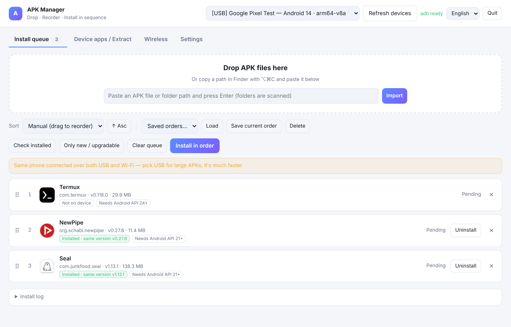
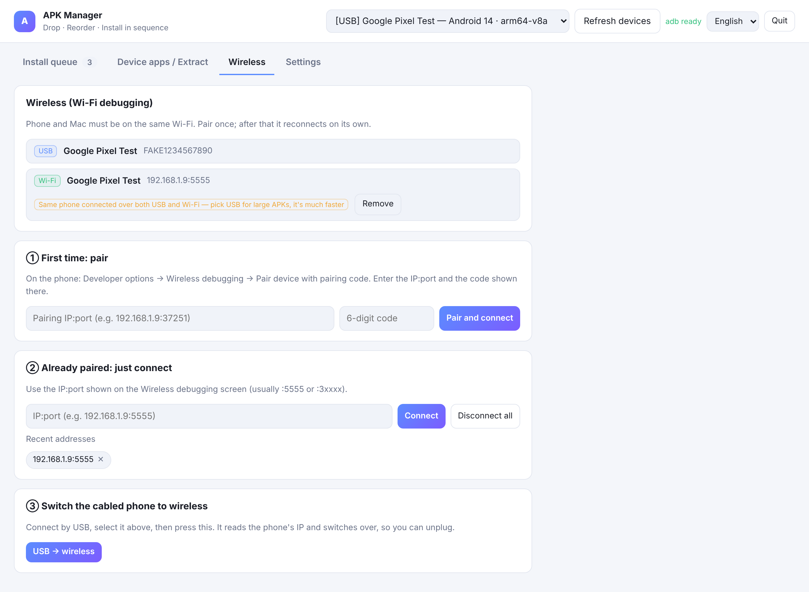
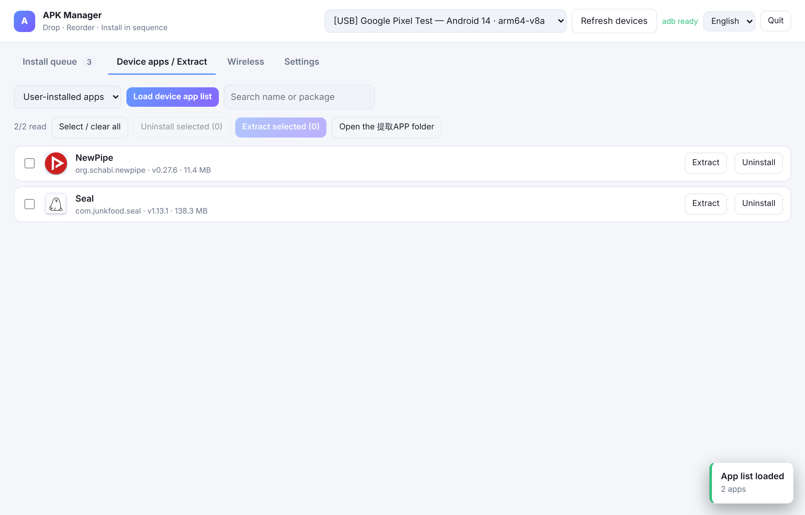

# APK Manager for Mac

**[English](README.md) · [日本語](README.ja.md) · [中文](README.zh-CN.md)**

A small macOS app for putting a pile of APKs onto Android devices — in the order *you* choose.
Drop the files in, drag them into the right order, hit install. Plug in a different phone and
the same order runs again. It also lists what's already on the device under the **real app
names you see on the phone**, and pulls any of them back out as APK files.

Pure Python standard library + a local web UI wrapped in a `.app` bundle. No `pip install`,
no Node, no Xcode. The only external dependency is `adb`, which the app can download for you.



| Wireless | Device apps / Extract |
| --- | --- |
|  |  |


---

## What it does

**Install queue**
- Drag APKs (or a whole folder) onto the window. `.apk`, `.xapk`, `.apks` and `.apkm` all work —
  split bundles are installed with `install-multiple` automatically.
- Reorder by dragging, or sort by app name / file name / package / size / version / date added.
- **Install in order**, one after another, with live progress.
- Save a named order ("new phone setup") and load it again on the next device.
- Every result is explained: success with version and elapsed time, failures with the actual
  reason *and* what to do about it (signature clash → uninstall first; device has a newer
  build → enable downgrade; phone refused → allow "Install via USB"; and so on).

**Already-installed markers**
- When a device connects, the queue is compared against it: *same version*, *older version →
  upgradable*, *device has newer*, or *not installed*.
- One click to install only what's new or upgradable — handy when setting up several phones.

**Device apps / extraction**
- Lists installed apps with their **real display names** (Chinese/Japanese names show properly)
  plus icons, version and size.
- Click **Extract** on any app to pull its APK into `提取APP/<name>_<package>_<version>/`.
  Split apps come out complete (`base.apk` + every `split_*.apk`) with an `info.txt`.
- Uninstall single apps or a batch, optionally keeping their data (`-k`).

**Wireless (Wi-Fi debugging)**
- Pair with the 6-digit code from Android's Wireless debugging screen, or connect straight to a
  known `IP:port`.
- One button turns a cabled phone into a wireless one (`adb tcpip` + auto-detected IP).
- Devices are labelled **USB** or **Wi-Fi**, and if the same phone is connected both ways the
  app says so — large APKs are much faster over the cable.
- Reconnects to the last wireless device on startup.

**Three languages** — English, 日本語, 中文. Switch in the top-right corner; it also changes the
macOS notification text.

---

## Install

1. Download the latest `APK-Manager-mac.zip` from
   [Releases](../../releases) and unzip it.
2. Move **APK Manager.app** wherever you like (Applications is fine).
3. **The first launch needs a right-click → Open → Open.** macOS blocks unsigned apps on a
   plain double-click. To skip the check entirely:
   ```bash
   xattr -dr com.apple.quarantine "/Applications/APK Manager.app"
   ```
4. Closing the window quits the app (~25 s later; it never quits mid-install).

Requires macOS 10.13+ and the system `python3`. If macOS says it's missing, run
`xcode-select --install` once.

### Phone setup (once)

1. Settings → About phone → tap **Build number** seven times.
2. Settings → Developer options → enable **USB debugging** (Xiaomi and friends also need
   **Install via USB**).
3. Plug in and tap **Allow** on the phone.

No `adb` on your Mac? Open **Settings → Download adb automatically** — it fetches Google's
official platform-tools.

---

## Run from source

```bash
git clone https://github.com/NegiGao/apk-manager-for-mac.git
cd apk-manager-for-mac
python3 app.py            # opens http://127.0.0.1:8777 in your browser
```

Build the `.app` bundle yourself (icon included, no extra tooling needed):

```bash
python3 tools/build_app.py     # → build/APK Manager.app
```

---

## How it works

| Piece | What it does |
| --- | --- |
| `core/binxml.py` | Parser for Android's binary XML and `resources.arsc` — written from scratch, no `aapt` |
| `core/apkinfo.py` | Package name, version, **real localized app label**, icon; bundle (`.xapk`/`.apks`) support |
| `core/adbkit.py` | adb wrapper: devices, install, pair/connect, and partial reads of remote APKs |
| `core/engine.py` | Queue, saved orders, install runner, install markers, uninstall, extraction |
| `core/server.py` | Local HTTP + SSE server, bound to `127.0.0.1` only |
| `web/` | The UI (vanilla JS, no framework) and the i18n table |

Two things worth calling out:

**Real app names without pulling whole APKs.** Reading labels off the device could mean copying
tens of gigabytes. Instead the app reads the remote APK's zip central directory, then fetches
*only* `AndroidManifest.xml` and `resources.arsc` (via `tail`/`head` over `adb exec-out`),
parses them locally, and picks the label matching your UI language. Results are cached per
package.

**Startup is kept off the critical path.** The HTTP port is bound before anything else, the adb
daemon warms up on a background thread, and the UI renders without waiting for either — the
window is up in about 0.2 s even when `adb start-server` takes seconds.

---

## Privacy

Everything runs locally on your Mac and is bound to `127.0.0.1`. Nothing is uploaded anywhere.
The only outbound connection the app can make is downloading platform-tools from Google, and
only when you press that button.

State lives in `~/Library/Application Support/APK安装管家/` (queue, saved orders, settings, icon
cache) and logs in `~/Library/Logs/`. Delete the app and those folders to remove it completely.

---

## FAQ

**"No device detected."** Use a cable that carries data, try another port, confirm you tapped
Allow on the phone, then press Refresh devices.

**Install hangs.** The phone is probably showing a confirmation dialog — unlock it. Some vendors
require "Install via USB" in Developer options.

**Reading the app list is slow.** The first pass reads metadata for every app; a few hundred
apps take a few minutes, and it's cached afterwards. "User-installed apps" is much faster than
"All apps".

**An app won't uninstall.** Preinstalled system apps can't be removed this way; the app tells
you when that's the reason.

---

## License

MIT — see [LICENSE](LICENSE).
